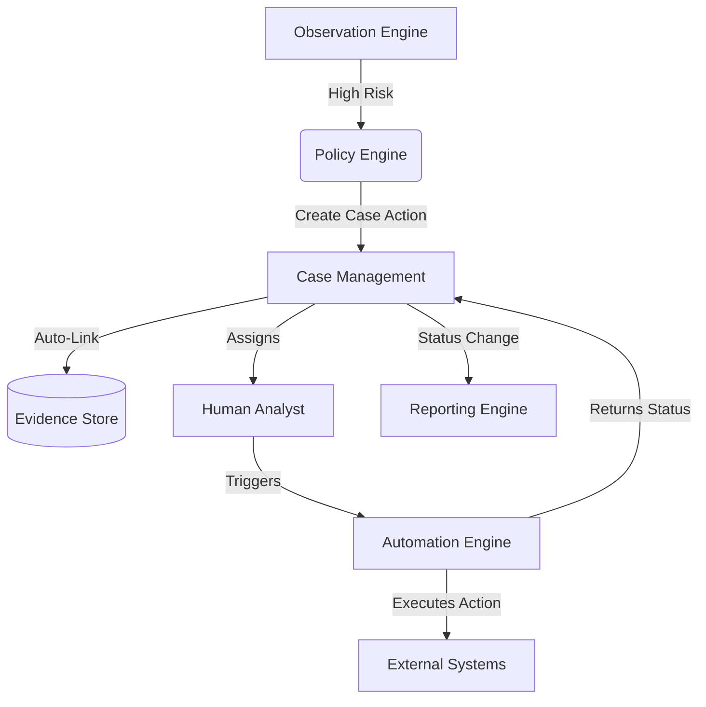

# Case Management Workflows

**Phase:** 7
**Project:** ASTRA

## 1. High-Level System Workflow
The Case Management module acts as the nexus point between human interaction and backend automation.

## 2. Evidence Preservation Workflow
To ensure that Cases maintain cryptographic integrity for auditing:
1. When a Case is created, it references the immutable `UUID` of the triggering Observation.
2. The Observation contains references to the original Correlation `hash`.
3. The Case Timeline stores changes as Append-Only records.
4. If an Analyst adds a file or comment, it is hashed and stored in the Evidence Store, with a foreign key linking back to the Case.
5. Deletion of Evidence linked to a Case is strictly prohibited at the database level.

## 3. Automation Feedback Loop
When a human Analyst decides to take action via the Case Management UI:
1. The Case transitions to `Mitigating`.
2. The Analyst selects a predefined Automation Action.
3. The Case Management API sends an asynchronous job to the Phase 6 Automation Queue.
4. The Case is locked from manual resolution while the Automation task is `PENDING` or `RUNNING`.
5. Upon Automation `SUCCESS` or `FAILURE`, a webhook updates the Case Timeline.
6. If `SUCCESS`, the Analyst may transition to `Resolved`. If `FAILURE`, the Case reverts to `Investigating` with a high-priority flag.

## 4. Reporting Metric Generation
Case state transitions are the primary drivers for Phase 5 Reporting Engine metrics:
- **Creation → Assignment:** Calculates Mean Time to Acknowledge (MTTA).
- **Creation → Resolved:** Calculates Mean Time to Respond (MTTR).
- **Resolved → Closed:** Measures QA/Review duration.
- Reports are generated asynchronously by querying the immutable Case Timeline events rather than the current Case state, ensuring historical accuracy even if a Case is reopened.
