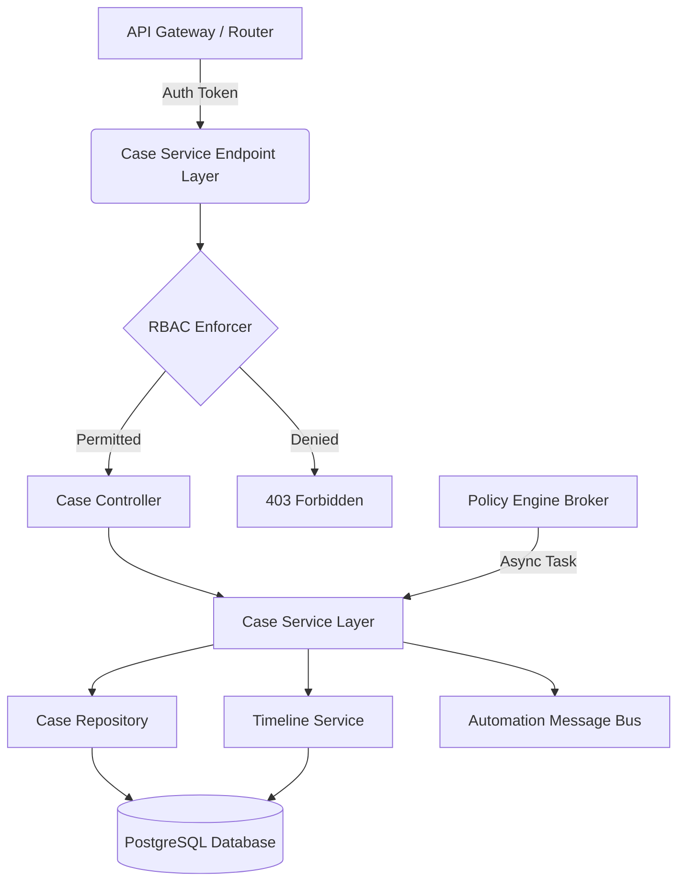

# Case Management Architecture

**Phase:** 7
**Project:** ASTRA

## 1. System Overview
The Case Management service is a decoupled, domain-driven module within the ASTRA platform. It relies on the API Gateway for authentication and routing, and the core PostgreSQL database for persistence. 

## 2. Component Architecture

## 3. Layer Responsibilities

### 3.1 Endpoint Layer (FastAPI Routers)
- Defines the RESTful API endpoints (`/api/v1/cases/*`).
- Handles Request/Response validation via Pydantic schemas.
- Example routes: `POST /cases`, `GET /cases/{id}`, `PATCH /cases/{id}/status`.

### 3.2 Service Layer (`CaseService`)
- Encapsulates the core business logic.
- Validates State Machine transitions (see `CASE_LIFECYCLE.md`).
- Orchestrates cross-domain calls (e.g., verifying an Evidence ID exists before linking it).
- Ensures that every state change or mutation generates a corresponding Timeline Event.

### 3.3 Timeline Service (`TimelineService`)
- A strict append-only service injected into the `CaseService`.
- Responsible for formatting and persisting Audit Events to the `case_timeline` table.

### 3.4 Repository Layer (`CaseRepository`)
- Handles direct SQLAlchemy interactions with PostgreSQL.
- Executes complex queries (e.g., filtering cases by Tag, assigned User, and open Status).

## 4. Separation of Concerns
- **No Direct Evidence Mutation:** The Case Service cannot modify Evidence records. It can only read Evidence IDs and create junction table entries (`case_evidence_links`).
- **No Policy Evaluation:** The Case Service does not evaluate risk. It passively receives instructions to create a case from the Policy Engine.
- **Asynchronous Execution:** The Case Service does not execute mitigation scripts. It dispatches a payload to the Automation Message Bus and waits for a webhook callback.
