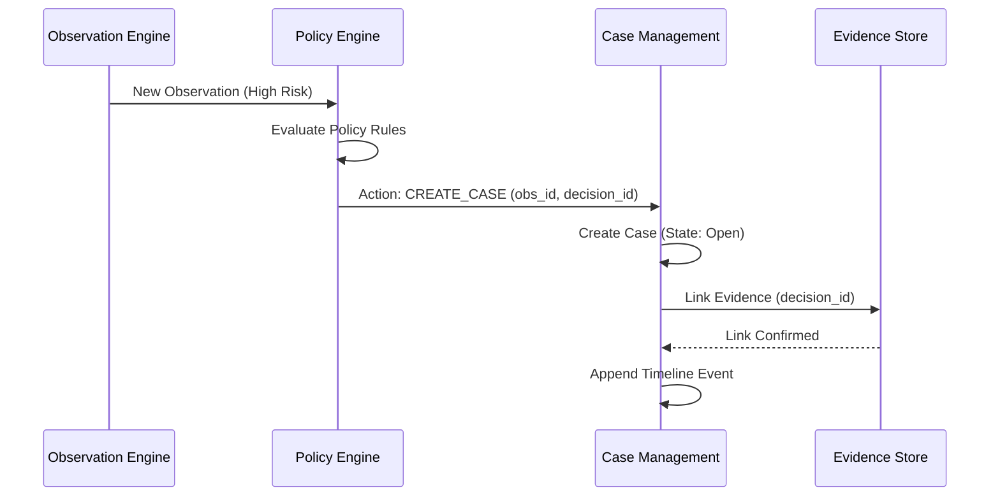

# Case Integration Architecture

**Phase:** 7
**Project:** ASTRA

## 1. Integration Scope
Case Management does not exist in a vacuum. It heavily relies on the outputs of preceding ASTRA phases.

## 2. External Domain Interactions

### 2.1 Phase 3: Observation Engine
- **Direction:** Observation → Case (One-to-Many potential, but usually One-to-One).
- **Mechanism:** When a Case is generated, it stores the `observation_id`. The Case UI fetches Observation details dynamically via read-only API calls to the Observation Service.
- **Constraint:** Cases do not duplicate Observation payload data (to avoid data staleness).

### 2.2 Phase 4: Policy Engine
- **Direction:** Policy Engine → Case Management.
- **Mechanism:** The Policy Engine evaluates an Observation. If the resulting action is `CREATE_CASE`, the Policy Engine asynchronously calls the internal Case Service creation endpoint.
- **Constraint:** The Policy Engine passes the `policy_decision_id` so the Case can link back to the exact rule that triggered it.

### 2.3 Phase 4.5: Evidence & Audit
- **Direction:** Case Management → Evidence Store.
- **Mechanism:** Cases link to Evidence via the `Case Evidence Link` junction table.
- **Chain of Custody:** When a Case is closed, the Evidence Store ensures that any Evidence linked to a Closed Case has its retention policy automatically extended to "Indefinite" or the regulatory maximum (e.g., 7 years).
- **Export Requirements:** Exporting a Case triggers an aggregation service that compiles the Case Timeline and all linked Evidence into a single cryptographically signed archive (e.g., zip file with SHA-256 manifest).

### 2.4 Internal Message Bus (Redis/Kafka)
- Case state transitions (e.g., `Investigating` -> `Resolved`) emit pub/sub events.
- These events are consumed by the Reporting Engine and Notification Services.

## 3. Interaction Diagram

