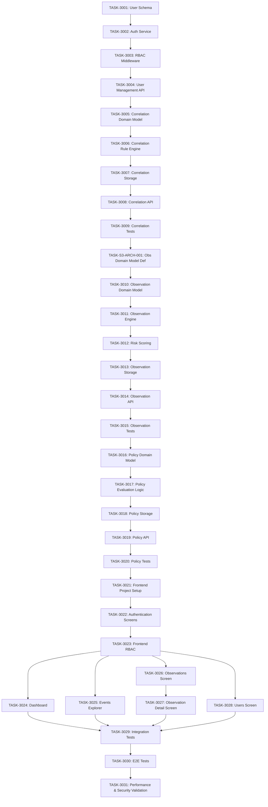

# ASTRA Sprint 3 Execution Order

This document defines the strict, dependency-mapped execution sequence for Sprint 3 tasks. Tasks must be executed in order from top to bottom.

## Execution Sequence Map

## Linear Execution Path

* **1.** `TASK-3001` User Schema
* **2.** `TASK-3002` Auth Service
* **3.** `TASK-3003` RBAC Middleware
* **4.** `TASK-3004` User Management API
* **5.** `TASK-3005` Correlation Domain Model
* **6.** `TASK-3006` Correlation Rule Engine
* **7.** `TASK-3007` Correlation Storage
* **8.** `TASK-3008` Correlation API
* **9.** `TASK-3009` Correlation Tests
* **10.** `TASK-S3-ARCH-001` Observation Domain Model Definition
* **11.** `TASK-3010` Observation Domain Model Implementation
* **12.** `TASK-3011` Observation Engine MVP
* **13.** `TASK-3012` Risk Scoring Module
* **14.** `TASK-3013` Observation Storage
* **15.** `TASK-3014` Observation API
* **16.** `TASK-3015` Observation Tests
* **17.** `TASK-3016` Policy Domain Model
* **18.** `TASK-3017` Policy Evaluation Logic
* **19.** `TASK-3018` Policy Storage
* **20.** `TASK-3019` Policy API
* **21.** `TASK-3020` Policy Tests
* **22.** `TASK-3021` Frontend Project Setup
* **23.** `TASK-3022` Authentication Screens
* **24.** `TASK-3023` Frontend RBAC
* **25.** `TASK-3024` Dashboard Screen
* **26.** `TASK-3025` Events Explorer
* **27.** `TASK-3026` Observations Screen
* **28.** `TASK-3027` Observation Detail Screen
* **29.** `TASK-3028` Users Screen
* **30.** `TASK-3029` Integration Tests
* **31.** `TASK-3030` E2E Tests
* **32.** `TASK-3031` Performance & Security Validation
