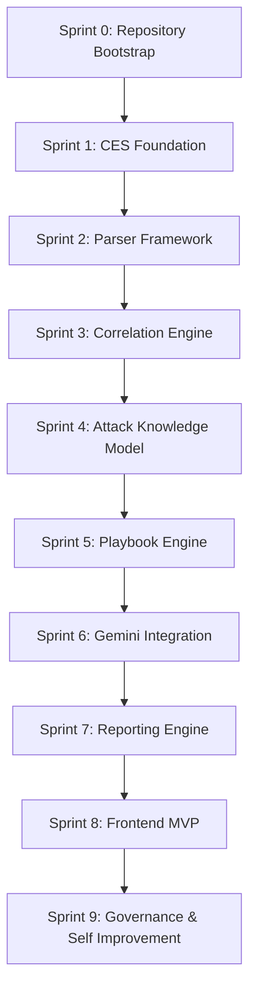

# ASTRA Sprint Plan

**Version:** 3.1
**Date:** 2026-06-12
**Status:** Approved

## 1. Executive Summary

The ASTRA v3.1 Sprint Plan transforms the frozen architecture and project documentation into an executable, incremental roadmap. Spanning 10 distinct sprints (Sprint 0 to 9), this plan ensures foundational layers like the Common Event Schema (CES) and Attack Knowledge Model (AKM) are built before dependent logic. This approach minimizes rework, guarantees end-to-end traceability, and continuously enforces security and quality from day one.

---

## 2. Sprint Overview Table

| Sprint | Name | Goal |
|---|---|---|
| **Sprint 0** | Repository Bootstrap | Create implementation foundation. |
| **Sprint 1** | CES Foundation | Create Common Event Schema foundation. |
| **Sprint 2** | Parser Framework | Convert raw logs into CES. |
| **Sprint 3** | Correlation Engine | Create event correlation layer. |
| **Sprint 4** | Attack Knowledge Model | Implement attack reasoning layer. |
| **Sprint 5** | Investigation Playbook Engine | Implement playbook-driven investigations. |
| **Sprint 6** | Gemini Integration | Integrate AI reasoning. |
| **Sprint 7** | Reporting Engine | Generate analyst-ready outputs. |
| **Sprint 8** | Frontend MVP | Create analyst workspace. |
| **Sprint 9** | Governance & Self Improvement | Implement governance layer. |

---

## 3. Detailed Sprint Definitions

> **Cross-Sprint Mandatory Requirements (Applies to ALL Sprints):**
> * Unit Tests & Integration Tests implemented.
> * Documentation Updates synchronized.
> * Security Validation completed.
> * Audit Validation passed.

---

# Sprint 0 — Repository Bootstrap

## Objective
Create implementation foundation.

## Business Value
Provides a robust, automated platform enabling fast, reliable, and secure development for all subsequent sprints.

## Scope
* Repository structure
* CI/CD
* Docker
* Linting
* Testing framework
* Environment configuration

## Deliverables
* Working repository
* Automated build pipeline

## Dependencies
* None

## Risks
* Configuration drift.
* Accidental exposure of secrets in initial commits.

## Exit Criteria
* CI pipeline passes successfully.
* Docker images build without errors.
* Code passes all defined linters.

## Success Metrics
* Build pipeline execution time < 5 minutes.
* 0 hardcoded secrets detected by scanners.

---

# Sprint 1 — CES Foundation

## Objective
Create Common Event Schema foundation.

## Business Value
Standardizes all downstream analysis, decoupling the platform's core logic from highly variable, vendor-specific log formats.

## Scope
* Event models
* Validation
* Schema definitions
* Transformation contracts

## Deliverables
* CES package
* Validation engine

## Dependencies
* Sprint 0

## Risks
* Overly rigid schema may fail to capture necessary edge-case event data.

## Exit Criteria
* CES models pass schema validation tests.
* Strict Pydantic schemas defined and imported successfully.

## Success Metrics
* 100% test coverage on CES models.
* 100% schema validation success.

---

# Sprint 2 — Parser Framework

## Objective
Convert raw logs into CES.

## Business Value
Enables the ingestion of real-world security data (VPN, Windows, Firewall), proving the platform's capability to read the environment.

## Scope
* Parser architecture
* VPN parser
* Windows Event parser
* Firewall parser

## Deliverables
* Parser SDK
* Initial parser implementations

## Dependencies
* Sprint 1

## Risks
* Complex, undocumented edge cases within raw log formats causing parse failures.

## Exit Criteria
* Parsers successfully convert sample raw logs to valid CES events.

## Success Metrics
* Parsing speed < 1 second per 10,000 logs.
* 0 CES schema validation errors on output.

---

# Sprint 3 — Correlation Engine

## Objective
Create event correlation layer.

## Business Value
Transforms isolated logs into cohesive incident candidates, drastically reducing the noise before AI analysis.

## Scope
* User correlation
* Host correlation
* IP correlation

## Deliverables
* Correlation engine

## Dependencies
* Sprint 2

## Risks
* Memory bloat and high latency during large time-window correlations.

## Exit Criteria
* Related CES logs are correctly grouped into unique incident objects.

## Success Metrics
* Correlation accuracy > 95% against the golden dataset.

---

# Sprint 4 — Attack Knowledge Model

## Objective
Implement attack reasoning layer.

## Business Value
Roots all investigations in known attacker behaviors and MITRE tactics, preventing AI hallucination and ensuring standardized security taxonomy.

## Scope
* MITRE mapping
* Knowledge repository
* Confidence scoring

## Deliverables
* AKM engine

## Dependencies
* Sprint 3

## Risks
* Over-engineering the knowledge graph, leading to unnecessary latency.

## Exit Criteria
* AKM properly scores and maps correlated incidents to MITRE tactics.

## Success Metrics
* Knowledge mapping accuracy >= 80%.

---

# Sprint 5 — Investigation Playbook Engine

## Objective
Implement playbook-driven investigations.

## Business Value
Standardizes investigation steps, guaranteeing consistent, explainable, and repeatable analytical outcomes.

## Scope
* Playbook execution engine
* VPN playbook
* PowerShell playbook
* Credential Dumping playbook
* Lateral Movement playbook

## Deliverables
* Playbook engine

## Dependencies
* Sprint 4

## Risks
* Rigid playbooks may fail or skip context on highly novel or zero-day attacks.

## Exit Criteria
* Playbook engine correctly executes defined steps over test incidents.

## Success Metrics
* 100% playbook compliance and execution success on defined golden scenarios.

---

# Sprint 6 — Gemini Integration

## Objective
Integrate AI reasoning.

## Business Value
Automates the heavy lifting of security analysis, generating deep context and reducing manual investigation times to minutes.

## Scope
* Prompt templates
* Structured output
* Output validation
* Confidence calibration

## Deliverables
* Gemini service

## Dependencies
* Sprint 5

## Risks
* AI hallucination or deviation from structured JSON outputs.
* Google Gemini API rate limiting or latency.

## Exit Criteria
* Gemini service successfully receives combined CES/AKM/Playbook payloads and outputs validated JSON with evidence references.

## Success Metrics
* Prompt validation success >= 95%.
* 100% of findings successfully map to an evidence ID.

---

# Sprint 7 — Reporting Engine

## Objective
Generate analyst-ready outputs.

## Business Value
Provides immediate, readable intelligence to analysts, satisfying the core project objective of accelerating investigations.

## Scope
* Timeline generation
* Narrative generation
* IOC reporting
* PDF export
* JSON export

## Deliverables
* Reporting service

## Dependencies
* Sprint 6

## Risks
* Formatting failures or data truncation in PDF exports.

## Exit Criteria
* Reports successfully generated with 100% evidence traceability.

## Success Metrics
* Complete timeline and narrative generation < 60 seconds.

---

# Sprint 8 — Frontend MVP

## Objective
Create analyst workspace.

## Business Value
Allows end-users to seamlessly interact with ASTRA, upload files, and view their investigations through an intuitive interface.

## Scope
* Authentication
* Upload workflow
* Investigation dashboard
* Report viewer

## Deliverables
* Functional UI

## Dependencies
* Sprint 7

## Risks
* UI latency or browser crashes when rendering extremely large timeline components.

## Exit Criteria
* The complete E2E user workflow (Upload -> Wait -> View) executes successfully via the frontend.

## Success Metrics
* React component test coverage >= 70%.
* 0 hardcoded secrets in the client bundle.

---

# Sprint 9 — Governance & Self Improvement

## Objective
Implement governance layer.

## Business Value
Ensures continuous quality, enforces strict security gates, and automates platform optimization, securing the long-term maintainability of ASTRA.

## Scope
* Audit engine
* Quality gate integration
* Improvement findings
* Technical debt detection

## Deliverables
* Audit platform
* Self-improvement platform

## Dependencies
* Sprint 8

## Risks
* Overly sensitive quality gates blocking valid production releases.

## Exit Criteria
* Audit score calculation is automated, and quality gates actively enforce release rules.

## Success Metrics
* Continuous audit score remains >= 90.

---

## 4. Dependency Diagram

---

## 5. Milestones

* **Milestone 1: Data Pipeline Ready (Post-Sprint 2)** – The system can ingest, parse, and strictly validate raw logs into CES.
* **Milestone 2: Intelligence Engine Ready (Post-Sprint 6)** – The backend can correlate logs, map them via AKM, execute playbooks, and return validated AI reasoning.
* **Milestone 3: MVP Release Candidate (Post-Sprint 8)** – Analysts can fully utilize the platform via the web UI.
* **Milestone 4: Production Governed (Post-Sprint 9)** – Continuous audit and self-improvement mechanisms are strictly enforcing platform standards.

---

## 6. Risks

* **Sequential Bottlenecks:** A strict dependency chain means delays in early sprints (e.g., Sprint 1 schema issues) will directly cascade into AI and Frontend development.
* **AI Output Drift:** If output validation in Sprint 6 is too lenient, prompt drift or AI hallucinations will severely disrupt the reporting engine in Sprint 7.
* **Schema Volatility:** Changes in CES or AKM post-implementation will trigger refactoring waves downstream.

---

## 7. Release Strategy

* **Per-Sprint:** Continuous Integration verifies the build, but code is not automatically pushed to production.
* **Milestone 2:** Internal Beta release deployed to staging for early security analyst feedback on AI reasoning accuracy.
* **Milestone 4:** Full MVP Production Release, strictly contingent upon passing all predefined Quality Gates.

---

## 8. MVP Definition

ASTRA MVP is formally complete when Sprints 0 through 9 are successfully delivered, the Golden Datasets pass 100%, the automated Audit Score remains >= 90, and the Docker-based deployment is validated end-to-end.

---

## 9. Definition of Done

A Sprint is formally completed **only if**:
1. All defined scope items are implemented.
2. Unit and Integration tests pass (minimum 70% coverage).
3. Documentation is synchronized with the new code state.
4. Security and Audit validations pass.
5. Code is successfully merged to the main branch without bypassing CI.

---

## 10. Post-MVP Roadmap

* **Integration Strategy:** Connect directly with external SIEMs via REST/Webhooks.
* **Stream Processing:** Transition from batch log uploads to real-time ingestion pipelines.
* **Vector Embeddings:** Adoption of `pgvector` for advanced AI embeddings to handle complex semantic similarity searches over past incidents.
