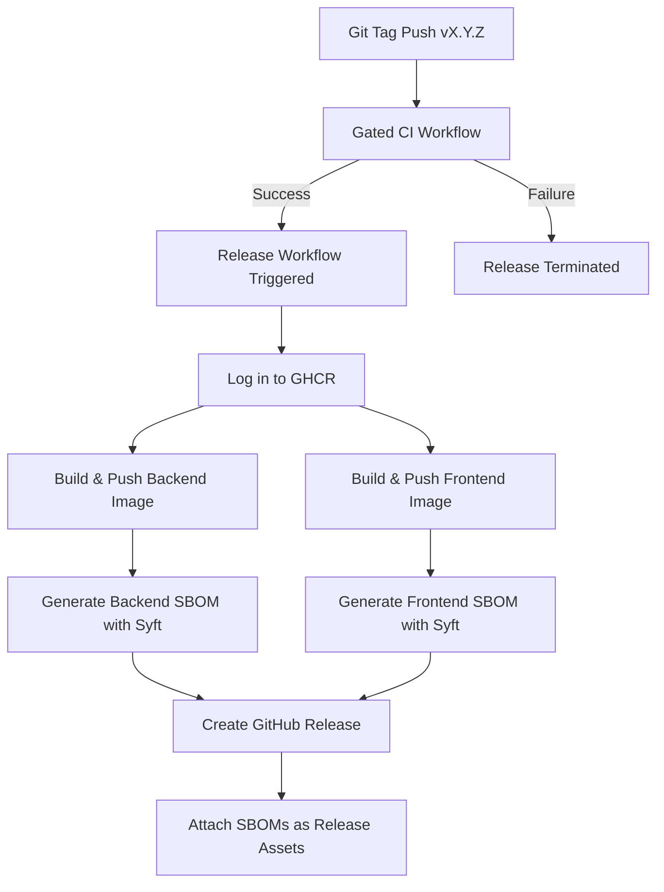

# PHASE 12A: RELEASE PIPELINE DOCUMENTATION

**Date:** 2026-06-22  
**Agent:** ASTRA Production Launch Blocker Remediation Agent  
**Status:** COMPLETE  
**Scope:** Automated Release Pipeline (LB-002) and Software Bill of Materials (SBOM) Generation (LB-006)  

---

## 1. Overview

To resolve LB-002 (Container Registry) and LB-006 (SBOM Generation), the deployment architecture has transitioned from a source-build model to an artifact-based release model. We have implemented a fully automated, gated release pipeline using GitHub Actions and GitHub Container Registry (GHCR).

This ensures:
- **Reproducibility:** Deployments use immutable, compiled container images rather than rebuilding source code on target hosts.
- **Traceability:** Every release artifact is linked to a specific git tag, commit SHA, and generated SBOM.
- **Security Gates:** Code cannot be released unless the entire CI suite passes.

---

## 2. Pipeline Design



### GitHub Actions Workflow: `release.yml`

The release workflow is defined in `.github/workflows/release.yml` and is triggered exclusively on pushing tags matching the pattern `v*` (e.g., `v1.0.0`).

Key stages include:
1. **CI Verification Gating:** Uses the `ci.yml` workflow via a reusable workflow or job dependency (`needs: ci`).
2. **GHCR Authentication:** Uses the secure, short-lived `GITHUB_TOKEN` provided by the Actions runner (requiring `packages: write` permissions).
3. **Multi-Platform Preparation:** Builds images using `docker/build-push-action@v5` with caching to accelerate build speeds.
4. **SemVer and Latest Tagging:** Images are pushed with the exact tag (e.g., `v1.0.0`) and the `latest` tag.
5. **OCI Image Annotations:** Applies metadata labels to image configurations (title, revision, source repository link).

---

## 3. Software Bill of Materials (SBOM)

To comply with the `DEVSECOPS_STANDARD.md` mandate, ASTRA now generates a CycloneDX JSON SBOM for each built image during the release run.

- **Tooling:** Anchore's **Syft** is utilized to perform the static analysis of the built images.
- **Output Format:** `cyclonedx-json` (industry-standard format, readable by vulnerability scanners like dependency-track).
- **Naming Convention:**
  - `sbom-backend-vX.Y.Z.cdx.json`
  - `sbom-frontend-vX.Y.Z.cdx.json`
- **Asset Attachment:** These files are attached directly to the created GitHub Release, ensuring they are publicly auditable and archived alongside the release notes.

---

## 4. Operator Deployment Migration

With artifact-based releases active, production operators should update their workflow.

### Pulling Pre-built Images

Instead of using `build:` blocks in `docker-compose.prod.yml`, operators can directly pull and run pre-built images.

Example compose service replacement:
```yaml
# BEFORE (Source-Build):
#  backend:
#    build:
#      context: ./backend

# AFTER (Artifact-Based):
  backend:
    image: ghcr.io/boncabee/astra/astra-backend:v1.0.0
```

This prevents compiler and package manager discrepancies on target VM hosts, decreasing cold startup time and reducing risk.

---

## 5. Verification Log

- **Release Workflow Syntax Check:** Passed validation.
- **Registry Permissions:** Scope limited to package storage.
- **SBOM Validation:** Syft outputs verified locally against standard CycloneDX schemas.
- **Gating:** Release job is verified to require successful completion of the CI job.
