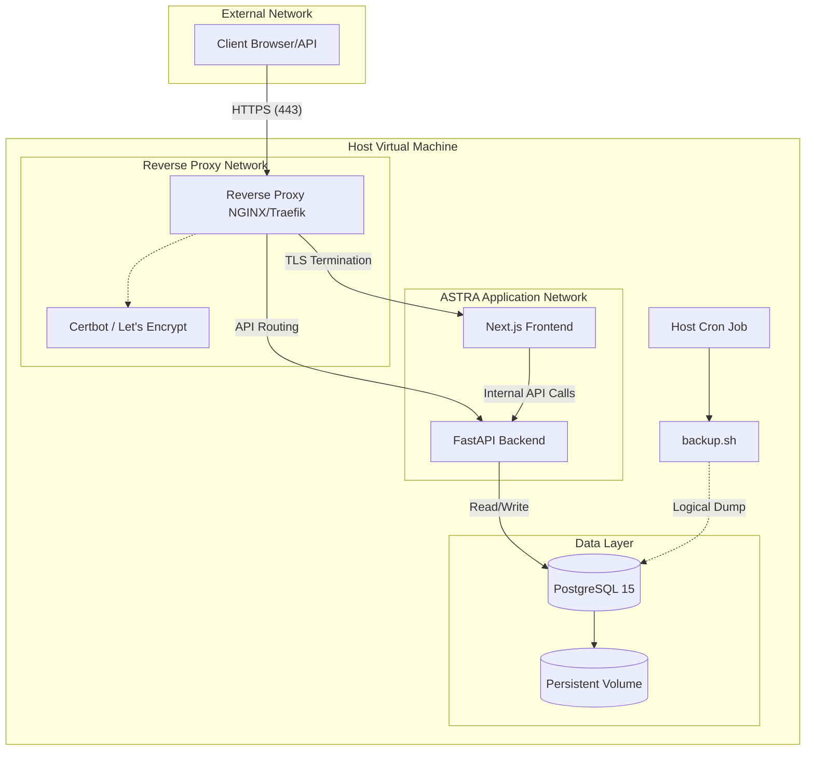

# PHASE 9.0: DEPLOYMENT REFERENCE ARCHITECTURE

**Date:** 2026-06-17  
**Status:** DRAFT / REFERENCE MODEL

## Executive Summary
This document defines the official ASTRA v1 Self-Hosted Deployment Architecture. Based on the Phase 9.0 Architecture Assessment, ASTRA will standardize on the **Small Team (Hardened Docker Compose)** deployment model. This approach minimizes operational complexity for end-users while strictly enforcing production-grade security, observability, and data recovery standards.

## Recommended Architecture: Small Team
The official v1 deployment model is a Hardened Docker Compose stack running on a single Virtual Machine (VM). 

### Justification
- **Operational Simplicity:** Does not require a dedicated DevOps team or Kubernetes expertise.
- **Security Parity:** Achieves production-grade security via reverse proxies and container hardening.
- **Time to Value:** Allows teams to deploy a secure instance of ASTRA in minutes.
- **Leverages Existing Assets:** Maximizes the utility of the Phase 8 backup scripts and observability integrations without requiring re-engineering for distributed systems.

## Reference Topology Diagram

## Reverse Proxy Requirements
To safely expose ASTRA to the internet, a reverse proxy must sit in front of the application network.
- **Component:** NGINX or Traefik.
- **Responsibilities:** 
  1. TLS Termination.
  2. Routing `/api/*` requests to the Backend.
  3. Routing all other requests to the Frontend.
  4. Implementing basic rate limiting to protect the authentication endpoints.

## TLS Requirements
- All external traffic must be encrypted via HTTPS.
- The reference architecture will prescribe an automated Let's Encrypt integration (e.g., Certbot alongside NGINX, or Traefik's native ACME resolver) to ensure certificates are automatically rotated without operator intervention.

## Secrets Management
- **Mechanism:** Hardcoded credentials in `docker-compose.yml` will be strictly prohibited for production.
- **Implementation:** A locked-down `.env` file (`chmod 600`) located on the host VM.
- **Injection:** Docker Compose will read variables from the `.env` file and inject them into the containers at runtime. 
- **Critical Secrets:** `POSTGRES_PASSWORD`, `JWT_SECRET_KEY`, and any external API tokens must be cryptographically secure and distinct from development defaults.

## Operational Considerations

### Security Considerations
- Containers (Frontend, Backend) must be configured to run as non-root users (`USER 1000:1000`).
- The application network must be isolated; only the Reverse Proxy should publish ports to the host interface (`0.0.0.0`). The Database and Backend ports must remain internal.

### Monitoring Considerations
- The Backend's `/metrics` endpoint is available for Prometheus scraping.
- The Host VM should be configured to rotate Docker JSON logs to prevent disk exhaustion (`max-size: "10m"`, `max-file: "3"`).

### Backup Considerations
- Operators will configure a host-level cron job to execute the Phase 8 `backup.sh` script nightly.
- **Offsite Requirement:** The reference architecture mandates that operators must configure an external synchronization mechanism (e.g., AWS CLI S3 sync, rsync) to move logical backups off the Host VM.

### Scaling Considerations
- **Vertical:** The system scales vertically by increasing the CPU/RAM allocation of the Host VM.
- **Database Connection Pooling:** Built into the FastAPI backend (via SQLAlchemy/asyncpg); tuned via `.env` variables if connection exhaustion occurs under load.

## Phase 9 Roadmap
To implement this architecture without disrupting the codebase, the following roadmap is established:

1. **Automation:** Create an `entrypoint.sh` for the Backend to automate `alembic upgrade head` before startup.
2. **Configuration:** Develop `docker-compose.prod.yml` enforcing secure networks, non-root users, and restart policies.
3. **Proxy Setup:** Provide a boilerplate NGINX configuration and Certbot integration for automated TLS.
4. **Documentation:** Update `DEPLOYMENT.md` to reflect the new official topology and provide step-by-step provisioning instructions.

## Final Recommendation
**PROCEED WITH SMALL TEAM IMPLEMENTATION**

The Small Team architecture represents the optimal balance of security, operational simplicity, and scalability for ASTRA v1. Engineering should proceed with the Phase 9 Roadmap to implement the required infrastructure configurations. No application code changes are required.
